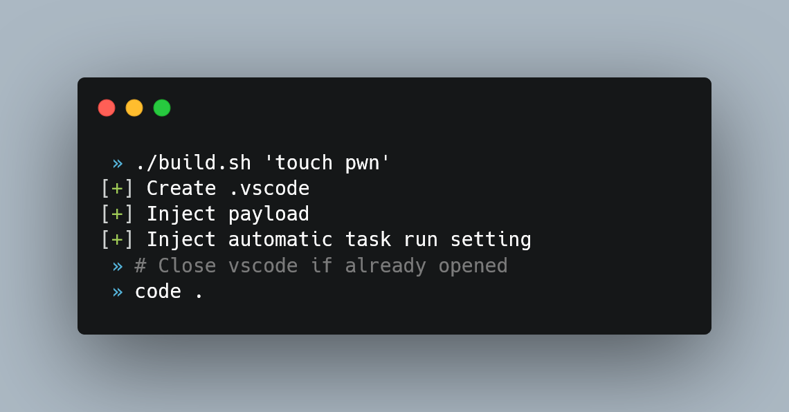

  <h1>😈 <code>.pwnvscode</code> 📁</h1>

<strong> Automatically perform RCE when opened with `vscode` </strong>

## How to use it?
* **Specify payload**: `./build.sh '[YOUR_RCE_PAYLOAD]'` It will create the malicious `.vscode` config folder
* **Inject the malicious `.vscode`** folder somewhere where the victim may open it with `vscode`
 Spread it using Social Engineering, malicious commit, etc...
* Wait

### Test it!

## Notes
* Target developers using `vscode` (**~50%** of devs use it)
* Not a vulnerability, rather a trick
* If you know the path of the malicious `.vscode` folder, trigger RCE with the URL: `vscode://file/C:\[path]\[to]\[project]` *(Phishing, open redirect, etc)*
* It is not the stealthest RCE of the world, but sometimes `.vscode` folder is not checked/changed by devs and can thus pass under the radar
* Work w/ `code` on windows (WSL also)
  * Does not seems to work on native linux
  * To test on MacOS
